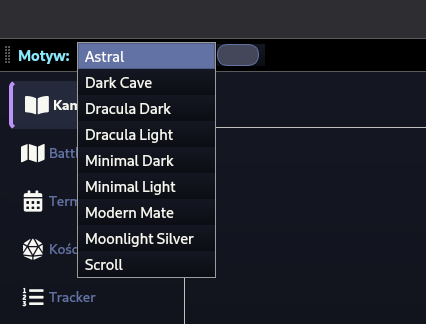
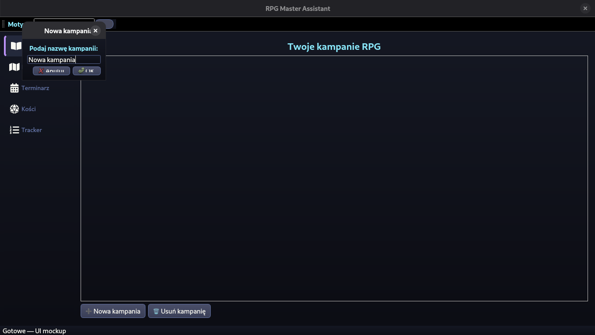
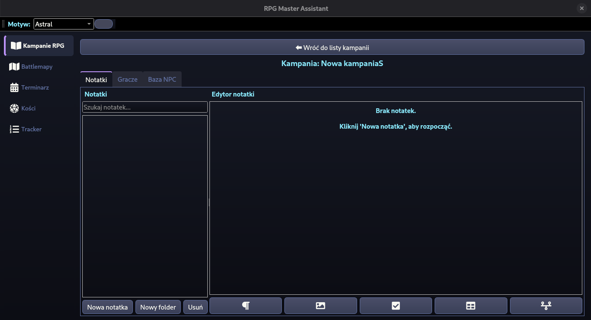
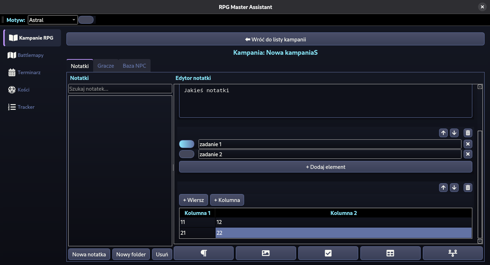
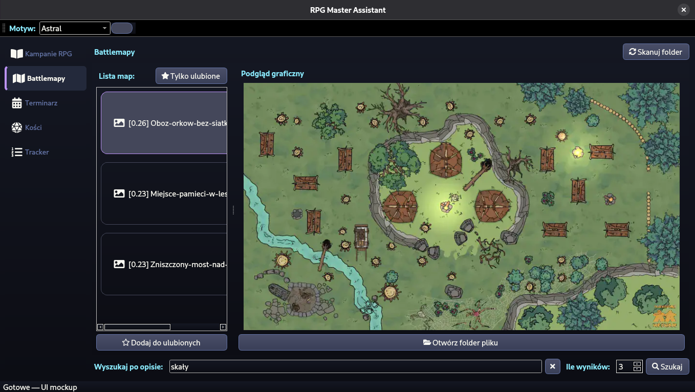
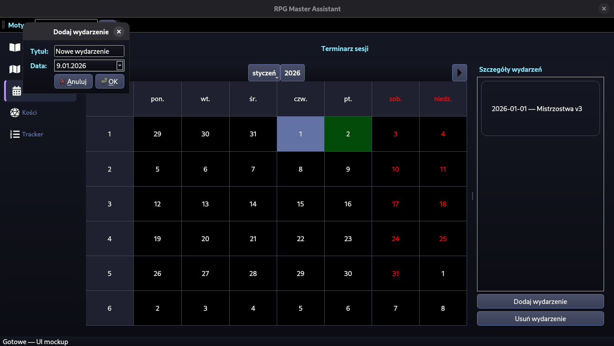
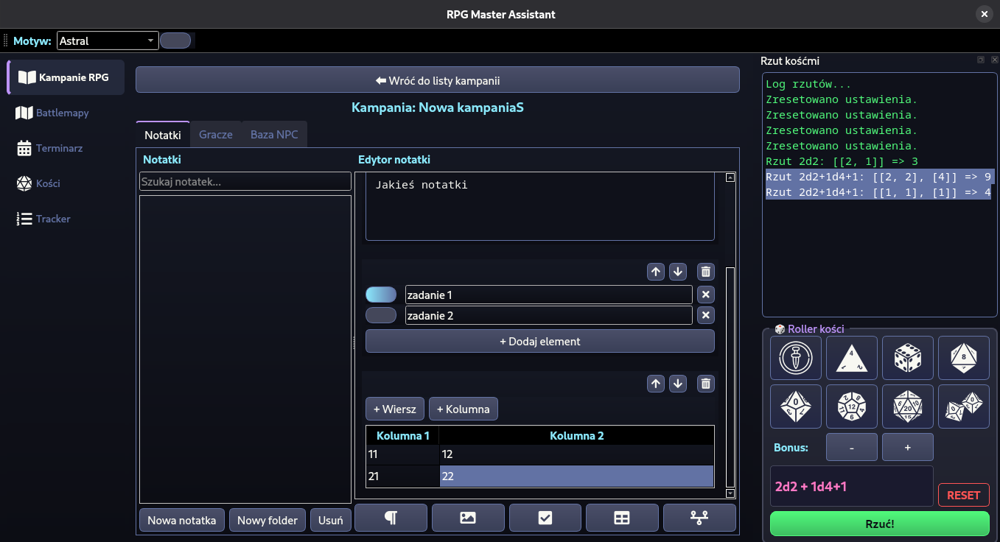
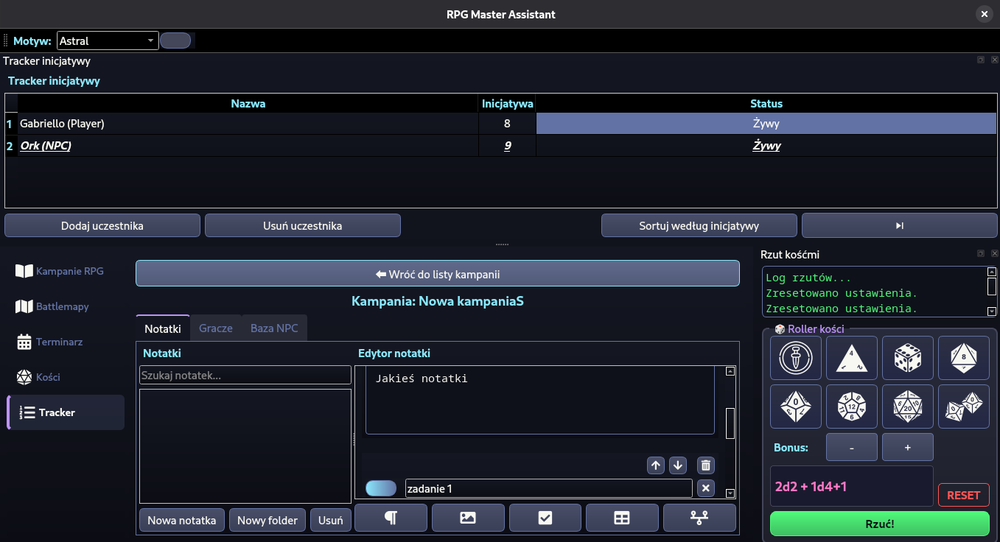

# Narrion Assystent mistrza gier RPG

Narzędzie wspierające Mistrzów Gry podczas sesji RPG. Aplikacja pomaga zarządzać informacjami o świecie gry, postaciach i wydarzeniach, a jednocześnie usprawnia organizację sesji i rozgrywkę - zarówno podczas przygotowań, jak i w trakcie samej sesji.

## Wymagania
Przed uruchomienie aplikacji należy się upewnić, że posiadamy zainstalowane:

- Python **3.12**
- UV
- Make

## Instalacja

1. Sklonowanie repozytorium
```bash
git clone https://github.com/masadows/Narrion.git
cd Narrion
```

2. Instalacja zależności
```bash
make requirements
```

3. (Opcionalnie) Konfiguracja kalendarza

    1. Stworz własny token dostępu do Google API:
    [Google API docs](https://developers.google.com/workspace/calendar/api/quickstart/python?hl=pl#configure_the_oauth_consent_screen)
    2. Skopiuj uzyskany plik `credentials.json` do katalogu `Narrion/data`

3. Uruchomienie aplikacji
```bash
make run
```

## Uruchamianie testów
Uruchomienie testów wymaga zainstalowania dodatkowych zależności
```bash
make requirements-dev
```
Aby uruchomić testy należy wykorzystać poniższą komendę
```bash
make test
```

## Instrukcja korzystania z aplikacji
### Wybieranie motywu
Możliwe jest zmiana motywu kolorystycznego aplikacji poprzez kliknięcie rozwijanej listy obok napisu `Motyw:` w lewym, górnym rogu aplikacji, a następnie wybranie preferowanej opcji.


### Kampania
#### Tworzenie kampanii
1. Wchodzimy w zakładkę `Kampanie RPG`.
2. Wybieramy `Nowa kampania`.
3. Wpisujemy nazwę kampanii w polu tekstowym.
4. Zatwierdzamy przyciskiem `Ok`.
5. Widok konkretnej kampanii jest dostępny po jej dwukrotnym kliknięciu.



#### Przemieszczanie się po kampanii
Aby wyjść z kampanii i wybrać inną, należy użyć przycisku `Wróć do listy kampanii`.

Kampania zawiera 3 bazowe zakładki:
- Notatki - zawierają wszystkie notatki związane z daną kampanią, umożliwiają tworzenie, edycję oraz usuwanie notatek,
- Gracze - Zakładka pozwalająca na dodawanie graczy biorących udział w rozgrywce,
- Baza NPC - Zakładka umożliwiająca zarządzanie NPC'ami.

Widok kampanii:



#### Notatki
Nową notatkę dodajemy korzystając z przycisku `Nowa notatka`, zostanie ona umieszczona w uprzednio wybranym przez z nas miejscu drzewka folderów. Nowy folder możemy dodać przyciskiem `Nowy folder`.
Każda notatka może zawierać różne elementy:
- tekst - pozwala na notowanie informacji
- obraz - umożliwia dołączenia obrazu
- checkbox - pozwala tworzyć listę z checkboxami
- tabela - prosta tabela z wierszami i kolumnami
- oś czasu - pozwala łatwiej śledzić chronologię wydarzeń

Element do notatki dodajemy, wybierając jeden z przycisków znajdujących się na dole okna. Po wybraniu przycisku w oknie pojawia się nowy element, który możemy edytować. Nowo dodany element zostaje umieszczony na końcu notatki. Danym elementem możemy zarządzać korzystając z przycisków w prawym górnym rogu elementu - możemy przesuwać je góra/dół lub usuwać.



#### Gracze oraz NPC
Obsługa Graczy oraz NPC'ów odbywa się w ten sam sposób.
Aby dodać nową postać, w odpowiednim oknie wybieramy przycisk `Dodaj`, ukaże się nam wtedy okno, do którego musimy wprowadzić nazwę gracza/NPC'a. Edycja postaci jest możliwa po wybraniu jej z listy znajdującej się po lewej stronie. Dostępne są następujące pola:
- HP
- AC
- Krótki opis
- Opis

### Battlemapy
Zakładka `Battlemapy` pozwala na łatwe wyszukiwanie interesującej nas mapy z większego zbioru.

Aby skorzystać z wyszukiwarki, korzystamy z przyisku `Skanuj folder`. Przy pierwszym uruchomieniu należy poczekać, aż zostanie pobrany model odpowiezialny za analizę obrazów. Po jego załadowaniu otwarte zostanie okno, pozwalające na wybranie folderu zawierającego mapy. Po otwarciu folderu, możemy skorzystać z wyszukiwarki. Na dole okna należy wpisać opis interesującej nas mapy np. "rzeka lawy". Następnie wybieramy ile wyników chcemy dostać i przyciskamy `Szukaj`. Model zwróci nam `n` obrazów najbardziej pasujących do wpisanej frazy. Następnie możemy wybrać obraz i skorzystać z `Otwórz folder pliku`, dzięki czemu łatwo odnajdziemy w folderze nasz obraz.



### Terminarz
Terminarz jest oknem pozwalającym na łatwe zapisywanie spotkań w kalendarzu google oraz ich odczytywanie. Po wejściu do tej zakładki wyświetlony zostanie kalendarz, z zaznaczonymi na zielono dniami, w które odbywają się zaplanowane przez nas spotkania. Listę spotkań zaplanowana na dany dzień zostanie wyświetlona po prawej stronie po kliknięciu w wybrany dzień. Spotkania można usunąć, wybierając je z listy, a następnie wciskając `Usuń wydarzenie`. Nowy spotkanie dodajemy wybierając `Dodaj wydarzenie`, a następnie uzupełniając jego tytuł oraz datę. Po dodaniu wydarzenia kalendarz się odświeży, a wydarzenie będzie już dodane do kalendarza Google. Przeglądać kalendarz możemy za pomocą strzałek lub wybierając konkretny, interesujący nas miesiąc.



### Kości
Wybierając zakładkę `Kości` nasze okno aplikacji zostanie podzielone i po prawej stronie pojawi się interfejs pozwalający na rzucanie kośćmi. Po równoległym otwarciu `Kości` i `Trackera` możliwe jest ich przeciąganie i dowolne rozmieszczanie w oknie.

Zakładka ta umożliwia rzucanie różnego rodzaju kośćmi:
- 2-ścienną,
- 4-ścienną,
- 8-ścienną,
- 10-ścienną,
- 12-ścienną,
- 20-ścienną,
- 100-ścienną.
oraz dodawanie do wyniku bonusu. Możliwe jest również rzucanie wieloma kośćmi na raz.

Aby dodać daną kość do rzutu, wystarczy na nią kliknąć. W okienku poniżej wyświetli się napis pokazujący jaką kość wybraliśmy. Napis jest skonstruowany w następującej formie: `xdy`, gdzie `x` oznacza liczbę kostek danego typu, `d` jest separatorem, a `y` oznacza ilość ścian kostki, np.

`2d20` - oznacza rzut 2 kostkami o 20 ścianach.

Możliwe jest też ustalenie bonusu, który w oknie wyświetla się jako `+z`, gdzie `z` to ilość punktów dodanych do wyniku. Aby rzucić kośćmi wybieramy przycisk `Rzuć!`. W oknie na górze pojawi się wynik w poniższym formacie np. dla rzutu `2d2 + 1d4 + 1`:

`Rzut 2d2+1d4+1: [[2, 1], [4]] => 8` - czyli:
- `[2, 1]` - dla 2 kości 2 ściennych wynikami jest 2 oraz 1
- `[4]` - dla 1 kości 4 ściennej wynikiem jest 4
- `8` - wynikiem rzutu jest 8, ponieważ 2+1+4+bonus(1) = 8

Aby użyć innych kości, należy wybrać przycisk `RESET` i ponownie wybrać kości, których chcemy użyć.



### Tracker inicjatywy
Wybierając `Tracker`, podobnie jak okno `Kości`, zostaje on domyślnie wyświetlony po prawej stronie naszego okna aplikacji. Możliwe jest dostosowanie położenia obydwu modułów w oknie, poprzez ich przeciąganie. `Tracker` służy do monitorowania kolejności akcji graczy oraz NPC'ów. Postacie dodajemy do trackera za pomocą przycisku `+`. Wyświetlone zostanie okno, w którym możemy wybrać z której ze zdefiniowanych kampanii chcemy dodać postać oraz jej typ (gracz/NPC). Następnie możemy dodać wybraną postać poprzez dwukrotne jej kliknięcie. Możemy również dodać nową, wcześniej niezdefiniowaną w żadnej kampanii postać, poprzez wybranie przycisku `Dodaj postać ręcznie` i wpisanie jej nazwy. Następnie należy podać wartość inicjatywy dla nowo dodanej postaci. Domyślnie postać jest dodawana ze statustem `Żywy`.

Po dodaniu wszystkich postaci i ustawieniu wartości inicjatyw należy kliknąć przyscisk sortowania, który ustawi postacie w kolejności. Przejście do tury następnej postaci odbywa się poprzez kliknięcie przycisku `->`. Przejście do następnej tury uwględnia statusy postaci oznacza to, że postacie postacie `Martwe` oraz `Ogłuszone` będą pomijane. Podczas gry można edytować inicjatywę oraz status postaci, klikając dwukrotnie na pola wartości przy danej postaci.

